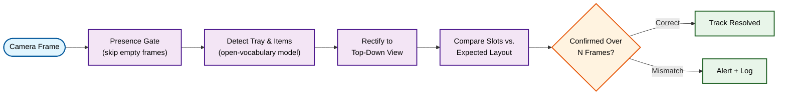

## Overview

Built an automated **visual inspection system** that verifies food-packaging layout on a production conveyor line, checking each tray's contents against an expected layout as it moves through the line.

---

## Technical Architecture

---

## Technical Approach

- **Open-Vocabulary Detection**: Uses a promptable segmentation model rather than a fixed-class detector, so tray and item categories can be redefined without retraining
- **Perspective-Normalized Verification**: Detected trays are rectified to a top-down view via a perspective transform, then each item is assigned to a slot and checked against an expected layout — a config-driven mapping rather than pixel-level template matching
- **Adaptive Compute for Line Speed**: A lightweight presence check filters out empty frames before running the heavier detection model, with inference rate scaled up only when a tray is actually on the line
- **Multi-Frame Confirmation**: A verdict must hold for several consecutive frames as a tray crosses the inspection zone before it's finalized, cutting false positives from single-frame noise

---

## Key Features

- **Real-Time Quality Control**: Flags layout mismatches before products leave the line
- **Config-Driven Layout Rules**: Expected item placement is defined as data, not code, so new tray layouts don't require redeploying the detection logic
- **Audit Trail**: Every flagged tray is logged with annotated images for human review

---

## Technologies Used

| Category | Tools |
|----------|-------|
| **Computer Vision** | YOLO (open-vocabulary segmentation), OpenCV |
| **Deployment** | Docker, GPU-accelerated edge inference |
| **Streaming** | RTSP |
