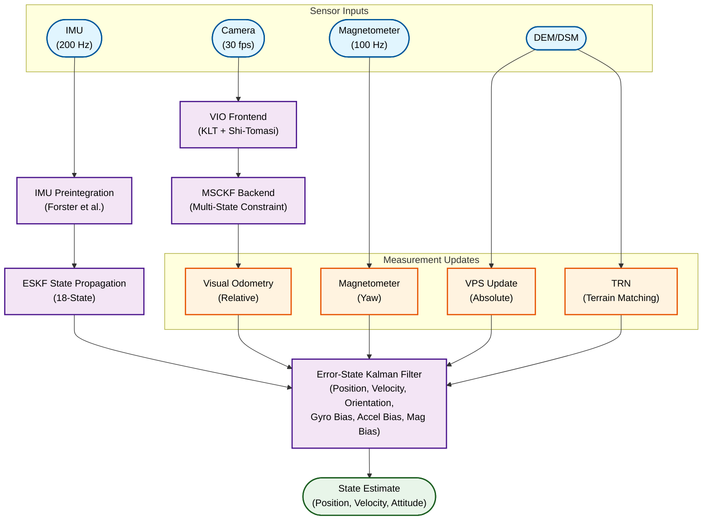

## Overview

Developed a modular **Visual-Inertial Odometry (VIO)** framework integrated with **Visual Positioning System (VPS)** using a custom **Error-State Extended Kalman Filter (ESKF)** for UAV navigation in GNSS-denied environments.

---

## Project Context

I developed a complete sensor fusion pipeline for UAV localization without GPS dependency. The system combines high-frequency IMU data with camera-based visual updates to maintain accurate pose estimation in challenging environments such as urban canyons, indoor spaces, and areas with GPS jamming or interference.

The implementation follows the **OpenVINS** methodology with custom extensions for VPS integration, terrain-referenced navigation, and magnetometer-based yaw correction.

---

## System Architecture

---

## Key Components

### Error-State Kalman Filter (ESKF)
- **18-state formulation**: Position (3), Velocity (3), Quaternion (4→3 error), Gyro Bias (3), Accel Bias (3), Mag Bias (3)
- **Manifold-based error representation**: Uses rotation vector (δθ) for minimal orientation error
- **Covariance propagation** with camera clone management for MSCKF

### VIO Frontend (OpenVINS-style)
- **Grid-based feature distribution**: Ensures uniform spatial coverage
- **Shi-Tomasi corner detector**: Better tracking quality than ORB/FAST
- **Multi-stage KLT tracking**: Coarse-to-fine optical flow with quality scoring
- **RANSAC-based outlier rejection**: Essential matrix validation

### Multi-State Constraint Kalman Filter (MSCKF)
- **Camera pose cloning**: Maintains sliding window of past camera poses
- **DLT triangulation**: Linear least squares for initial 3D point estimation
- **Gauss-Newton refinement**: Nonlinear optimization for accurate feature positions
- **Nullspace projection**: Marginalize feature states to reduce computation

### IMU Preintegration
- **On-Manifold preintegration** following Forster et al. (TRO 2017)
- **Bias-corrected deltas**: ΔR, Δv, Δp with first-order Jacobian correction
- **Covariance propagation**: Tracks uncertainty through integration period

### Visual Positioning System (VPS) Integration
- **Absolute position updates**: Correct accumulated drift periodically
- **Adaptive innovation gating**: Multi-tier acceptance based on drift time
- **DEM-based altitude constraint**: Uses terrain data for Z-axis correction

### Terrain Referenced Navigation (TRN)
- **Profile correlation matching**: Compares measured altitude with DEM terrain
- **Grid search + refinement**: Efficient position fix computation
- **Configurable parameters**: Search radius, correlation threshold, update interval

### Magnetometer Processing
- **Hard-iron/soft-iron calibration**: Corrects sensor distortions
- **EMA filtering**: Smooth yaw estimates with outlier rejection
- **Gyro consistency check**: Validates mag readings against gyro integration

---

## Hardware Deployment

| Platform | Specs |
|----------|-------|
| **Raspberry Pi 5** | ARM Cortex-A76, 8GB RAM |
| **Orange Pi 5** | RK3588S, 8GB RAM |

---

## Technologies Used

| Category | Tools |
|----------|-------|
| **State Estimation** | Custom ESKF (filterpy-based), NumPy, SciPy |
| **Visual Odometry** | OpenCV (KLT, RANSAC), Shi-Tomasi corners |
| **IMU Processing** | On-manifold preintegration, bias estimation |
| **Terrain Data** | GDAL/rasterio for DEM/DSM processing |
| **Coordinate Systems** | pyproj for UTM/lat-lon conversions |
| **Languages** | Python (primary), C++ (drivers) |

---

## Key References

1. **OpenVINS**: Geneva et al., "OpenVINS: A Research Platform for Visual-Inertial State Estimation", IROS 2020
2. **IMU Preintegration**: Forster et al., "On-Manifold Preintegration for Real-Time Visual-Inertial Odometry", TRO 2017
3. **MSCKF**: Mourikis & Roumeliotis, "A Multi-State Constraint Kalman Filter for Vision-aided Inertial Navigation", ICRA 2007

