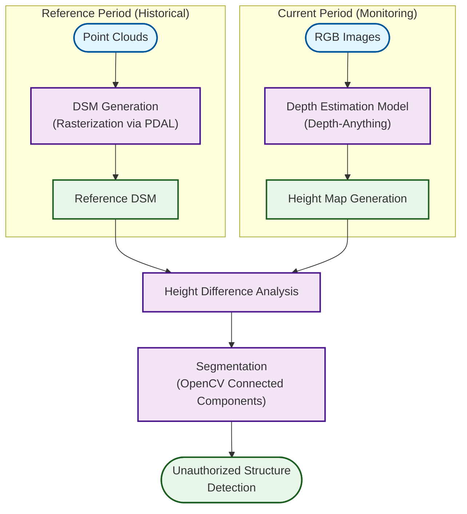

## Overview

Developed an **end-to-end surveillance system** to identify unauthorized urban structures by analyzing height variations rather than just visual differences.

---

## Problem Statement

Conventional change detection methods primarily utilize RGB data, making them vulnerable to radiometric inconsistencies such as:
- varying illumination
- cast shadows
- seasonal contrast

These artifacts often obscure actual physical changes on the ground.

Our Approach: We address this limitation by converting 2D images into **depth-derived height maps**. This approach decouples structural information from visual appearance, allowing the system to robustly detect vertical displacement caused by unauthorized construction, regardless of lighting or weather conditions.

---

## Technical Pipeline

### Process Breakdown

**1. Reference Flow (Left Branch):**
- **Input**: Point Clouds (e.g., historical LiDAR or Photogrammetry data).
- **Process**: **DSM Generation (Rasterization)** - Converting massive point cloud data into a grid-based Raster format to align with the current period's data format for subtraction.
- **Output**: **Reference DSM** (Digital Surface Model) representing the baseline surface including structures.

**2. Current Flow (Right Branch):**
- **Input**: RGB Images (Current monitoring photos).
- **Process**: **Depth Estimation Model** (utilizing **Depth-Anything**) to predict depth from 2D images.
- **Output**: **Height Map** (AI-predicted DSM).

**3. Analysis Flow (Integration):**
- **Height Difference**: Calculating the differential between the Reference DSM and the Current Height Map.
- **Segmentation**: Utilizing **OpenCV Connected Components** (Blob detection) to identify clusters of pixels with anomalous height differences, distinguishing actual structural objects from random noise.
- **Result**: Precise localization of **Unauthorized Structures**.

---

## Detection Capabilities

| Type | Description | Example |
|------|-------------|---------|
| **Vertical Extensions** | Additional floors | Rooftop structures |
| **Horizontal Extensions** | Building expansion | Side annexes |
| **New Structures** | Completely new builds | Warehouses, Sheds |
| **Height Violations** | Exceeding limits | Antenna, Tank installations |

---

## Key Results

- **Quantitative Analysis**: Fine-grained height estimation enabling precise unauthorized structure identification
- **False Positive Reduction**: 80% reduction by eliminating visual noise (shadows/seasons)
- **Automated Pipeline**: End-to-end processing with autonomous anomaly detection

---

## Technologies Used

| Category | Tools |
|----------|-------|
| **Depth Estimation** | Depth-Anything, OpenCV |
| **Point Cloud & 3D Processing** | Open3D, PDAL, NumPy |
| **Geospatial Analysis** | GDAL, Rasterio, GeoPandas |
| **Visualization** | Three.js, QGIS, Matplotlib |
| **Languages** | Python |
