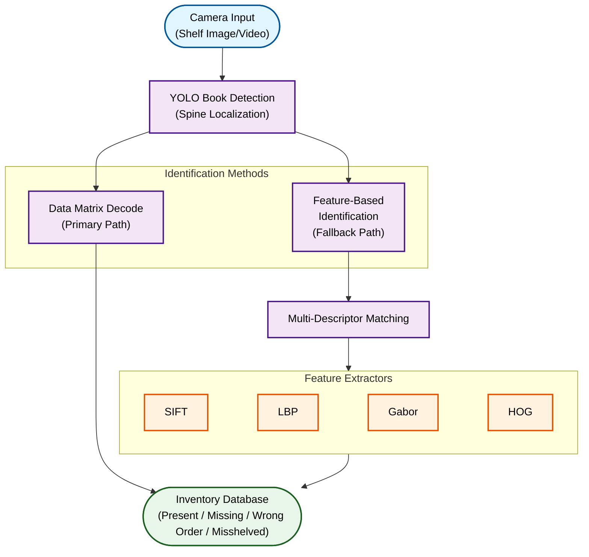

## Overview

Contributed to the development of an **automated library shelf auditing system** using computer vision for real-time book detection, identification, and shelf auditing. This project was developed for the **National Library of Luxembourg**, enabling efficient visual inventory management across their extensive collection.

    

        
    

    

        
    

---

## Project Context

I worked on vision-based inventory management solutions, deploying YOLO and feature matching techniques to automate visual auditing workflows.

---

## System Architecture

---

## Detection Pipeline

### Primary Path: Barcode Decoding
- **Data Matrix** / ISBN barcode detection
- Direct database lookup for instant identification
- Works best for books with visible, undamaged barcodes

### Fallback Path: Feature Matching
When barcodes are unreadable, the system uses **multi-descriptor matching** with books in database:

| Descriptor | Purpose | Strength |
|------------|---------|----------|
| **SIFT** | Scale-invariant features | Rotation/scale robust |
| **LBP** | Texture patterns | Lighting invariant |
| **Gabor** | Frequency/orientation | Pattern recognition |
| **HOG** | Shape gradients | Structural features |

---

## Inventory Status Detection

| Status | Description | Action |
|--------|-------------|--------|
| ✅ **Present** | Book in correct location | No action needed |
| ❌ **Missing** | Book not found on shelf | Alert librarian |
| ❌ **Wrong Order** | Book in wrong order | Alert librarian |
| ⚠️ **Misshelved** | Book in wrong location | Alert librarian |
| ⚠️ **Extra** | Unlisted book detected | Alert librarian |

---

## Technologies Used

| Category | Tools |
|----------|-------|
| **Object Detection** | YOLO |
| **Feature Extraction** | SIFT, ORB, LBP, HOG, Gabor |
| **Barcode** | Data Matrix |
| **Framework** | OpenCV, PyTorch |
| **Languages** | Python |
