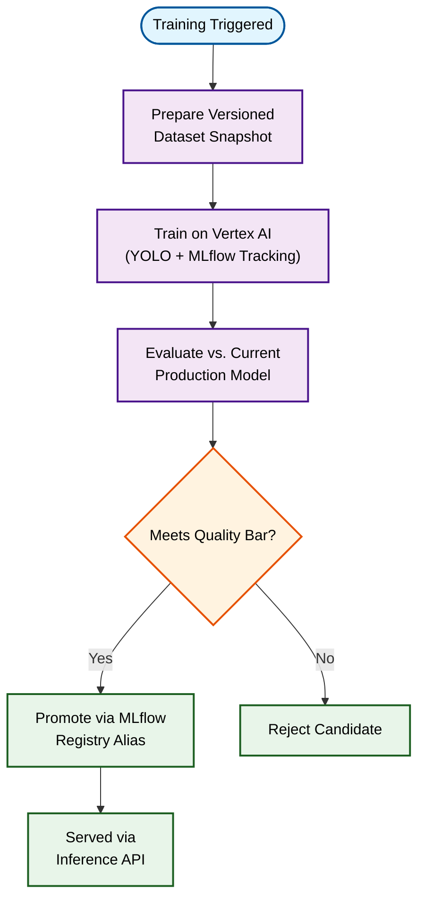

## Overview

Built an end-to-end **MLOps pipeline** for an internal satellite-imagery object detection platform, replacing a manual, post-annotation workflow with a fully automated pipeline on **Google Cloud Platform (GCP)**. Every candidate model is evaluated against the current production model before it's promoted, with full lineage tracked through MLflow.

    

        
    

    An internal dashboard for monitoring training runs, pulling live status and evaluation metrics from MLflow and Supabase.

---

## System Architecture

---

## Technical Approach

- **Automated, API-Triggered Pipeline**: A single call kicks off dataset preparation, GPU training on Vertex AI, and evaluation — no manual steps in between
- **Versioned, Reproducible Datasets**: Every training run uses a versioned dataset snapshot, so any model's training data is always traceable
- **Gated Promotion**: Candidate models are only promoted if they meet a quality bar and don't regress against the current production model on the same evaluation data
- **Safe Rollback**: Promotion works by repointing an MLflow Model Registry alias rather than redeploying artifacts, so reverting a bad promotion is instant
- **Registry-Driven Serving**: A separate inference API resolves models directly from the MLflow registry by version and validated status, with in-process caching so the same model version isn't re-downloaded on every request
- **Self-Hosted MLflow**: The tracking server and model registry are self-hosted with group-based authentication, giving full control over access and retention rather than relying on a managed offering

---

## Why MLOps + MLflow Here

- **Full Lineage**: MLflow tracks the dataset, parameters, and resulting weights for every run, so any promoted model's provenance is reconstructable later
- **Apples-to-Apples Comparison**: Candidate and production models are scored on identical data before a promotion decision is made
- **Confidence in Every Deployment**: Nothing reaches production without clearing an automated evaluation gate

---

## Technologies Used

| Category | Tools |
|----------|-------|
| **Cloud Platform** | Google Cloud Platform (Vertex AI, Cloud Run, Cloud Storage) |
| **MLOps** | MLflow (self-hosted Tracking + Model Registry), GitHub Actions |
| **Computer Vision** | YOLO |
| **Serving** | FastAPI, in-process model caching |
| **Backend** | FastAPI, PostgreSQL |
