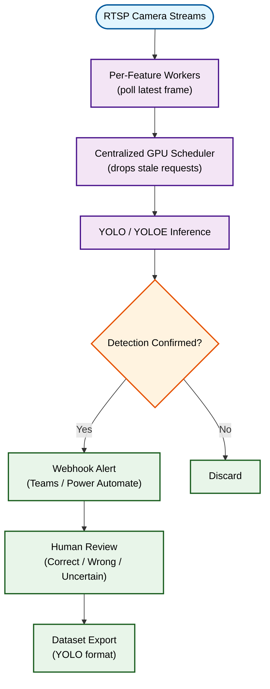

## Overview

Built a real-time, multi-camera **safety compliance analytics system** for industrial facilities, streaming over **RTSP** and covering four core detection features: obstruction, intrusion, PPE (personal protective equipment), and fire/smoke.

---

## Pipeline

---

## Technical Approach

- **Independent Per-Feature Pipelines**: Each detection feature (obstruction, intrusion, PPE, fire/smoke) runs as its own worker polling the latest available frame at its own rate, so a slow detector never stalls a fast one
- **Centralized GPU Scheduling**: A shared priority queue arbitrates inference requests across all cameras and features, dropping stale requests in favor of newer frames to stay real-time under load
- **Zone-Aware Detection**: Intrusion and obstruction use per-camera configurable zone masks, with background-change pre-filtering to avoid running inference on static, uneventful frames
- **Evidence-Based Alerting**: PPE non-compliance accumulates evidence over a short window rather than alerting on a single frame, cutting false positives from momentary detection noise

---

## Human-in-the-Loop MLOps

- **Review Workflow**: Reviewers confirm, reject, or mark each alert uncertain from a dashboard, optionally correcting the detected class
- **Dataset Curation Loop**: Reviewed feedback is exported into YOLO-format training datasets for offline model fine-tuning — every reviewed alert becomes potential training data

---

## Key Features

- **Multi-Camera, Multi-Feature**: Each camera is independently configured for which detection features it runs
- **Automated Alerting**: Confirmed detections trigger webhook notifications (Microsoft Teams / Power Automate) with de-duplication to prevent alert spam
- **Resilient Streaming**: Automatic reconnect handling and live camera-status tracking

---

## Impact

Encouraged stricter adherence to safety procedures on the factory floor and enabled proactive incident response by surfacing issues before they escalated.

---

## Technologies Used

| Category | Tools |
|----------|-------|
| **Computer Vision** | YOLO, YOLOE (open-vocabulary detection), ByteTrack/BoT-SORT |
| **Streaming** | RTSP, MediaMTX (WebRTC/HLS relay) |
| **Backend** | FastAPI, PostgreSQL |
| **Alerting** | Microsoft Teams / Power Automate webhooks |
| **Deployment** | Docker Compose |
